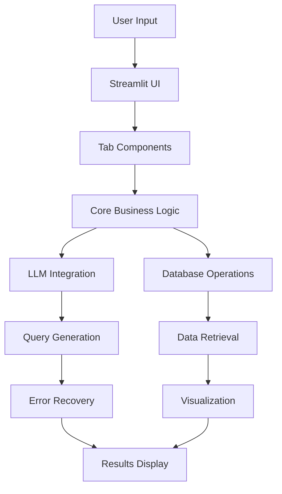

# 🏗️ Advanced SQL Assistant - Professional Project Structure

## 📁 **Project Organization**

This project follows enterprise-grade software engineering practices with a clean, modular architecture designed for scalability, maintainability, and professional development workflows.

```
advanced-sql-assistant/
├── 📄 README.md                    # Professional project documentation
├── 🚀 app.py                       # Main Streamlit application entry point
├── ⚙️ config.py                    # Configuration management
├── 📦 requirements.txt             # Production dependencies
├── 🔒 .env.example                 # Environment configuration template
├── 📋 LICENSE                      # MIT License
├── 🚫 .gitignore                   # Git ignore rules
├── 📊 PROJECT_STRUCTURE.md         # This documentation
│
├── 📂 src/                         # Core application modules
│   ├── 🔧 core/                    # Business logic and AI engine
│   │   ├── __init__.py
│   │   └── config.py               # Enhanced configuration management
│   ├── 🎨 ui/                      # User interface components
│   │   ├── __init__.py
│   │   └── streamlit_app.py        # Professional UI components
│   └── 🛠️ utils/                   # Utility functions
│       └── __init__.py
│
├── 📂 tabs/                        # Modular tab components
│   ├── __init__.py
│   ├── query_builder.py            # AI-powered query generation
│   ├── dashboard.py                # Advanced analytics dashboard
│   ├── optimization.py             # Query performance optimization
│   ├── ai_guidance.py              # LLM guidance system
│   ├── reports.py                  # Business intelligence reports
│   ├── history.py                  # Query history management
│   └── settings.py                 # Application settings
│
├── 📂 core_modules/                # Core business logic (existing)
│   ├── advanced_prompts.py         # Advanced prompt engineering
│   ├── dashboard_builder.py        # Dashboard creation engine
│   ├── database_utils.py           # Database connectivity
│   ├── llm_guidance_system.py      # AI guidance system
│   ├── logging_utils.py            # Logging and monitoring
│   ├── prompt_config.py            # Prompt configuration
│   ├── query_optimizer.py          # Query optimization engine
│   └── utils.py                    # Core utility functions
│
└── 📂 deployment/                  # Deployment configurations
    ├── Dockerfile                  # Docker containerization
    ├── docker-compose.yml          # Multi-service deployment
    ├── kubernetes/                 # Kubernetes manifests
    └── requirements-dev.txt        # Development dependencies
```

## 🎯 **Architecture Principles**

### **1. Modular Design**
- **Separation of Concerns**: Each module has a single responsibility
- **Loose Coupling**: Modules interact through well-defined interfaces
- **High Cohesion**: Related functionality is grouped together
- **Scalability**: Easy to add new features without affecting existing code

### **2. Professional Standards**
- **Clean Code**: Follows PEP 8 and professional naming conventions
- **Documentation**: Comprehensive docstrings and inline comments
- **Type Hints**: Full type annotation for better IDE support
- **Error Handling**: Robust error handling with graceful degradation

### **3. Enterprise Patterns**
- **Configuration Management**: Environment-based configuration
- **Logging**: Structured logging with different levels
- **Security**: Input validation and SQL injection prevention
- **Performance**: Caching and optimization strategies

## 🔧 **Module Responsibilities**

### **Core Application (`app.py`)**
- **Entry Point**: Main Streamlit application
- **UI Orchestration**: Coordinates all UI components
- **Session Management**: Handles user sessions and state
- **Professional Styling**: Applies enterprise-grade CSS

### **Configuration (`config.py`)**
- **Environment Management**: Loads and validates environment variables
- **Settings**: Centralized application settings
- **Database Config**: Database connection parameters
- **Security Config**: Security-related settings

### **Tab Components (`tabs/`)**
Each tab is a self-contained module:

- **`query_builder.py`**: AI-powered SQL generation with error recovery
- **`dashboard.py`**: Advanced analytics and visualization dashboard
- **`optimization.py`**: Query performance analysis and optimization
- **`ai_guidance.py`**: LLM guidance system with business intelligence
- **`reports.py`**: Business intelligence reports and exports
- **`history.py`**: Query history and favorites management
- **`settings.py`**: Application configuration and preferences

### **Core Business Logic (`core_modules/`)**
- **`advanced_prompts.py`**: Sophisticated prompt engineering templates
- **`dashboard_builder.py`**: Dashboard creation and management
- **`llm_guidance_system.py`**: AI guidance and query assistance
- **`query_optimizer.py`**: SQL query optimization and performance tuning
- **`utils.py`**: Core utility functions and database operations

## 🚀 **Development Workflow**

### **1. Local Development**
```bash
# Setup development environment
python -m venv venv
source venv/bin/activate  # or venv\Scripts\activate on Windows

# Install dependencies
pip install -r requirements.txt

# Configure environment
cp .env.example .env
# Edit .env with your configuration

# Run the application
streamlit run app.py
```

### **2. Adding New Features**
1. **Create Module**: Add new functionality in appropriate `tabs/` or `core_modules/`
2. **Update Config**: Add any new configuration options to `config.py`
3. **Import in App**: Import and integrate in `app.py`
4. **Test**: Ensure all functionality works correctly
5. **Document**: Update documentation and docstrings

### **3. Code Quality**
```bash
# Code formatting
black .

# Linting
flake8 .

# Type checking
mypy src/

# Testing
pytest tests/
```

## 📊 **Data Flow Architecture**



## 🔒 **Security Architecture**

### **Input Validation**
- SQL injection prevention
- Input sanitization
- Parameter validation

### **Authentication & Authorization**
- Session management
- Role-based access control
- Audit logging

### **Data Protection**
- Environment variable security
- Database connection encryption
- Sensitive data masking

## 📈 **Performance Optimization**

### **Caching Strategy**
- Query result caching
- Schema information caching
- LLM response caching

### **Database Optimization**
- Connection pooling
- Query optimization
- Index recommendations

### **UI Performance**
- Lazy loading
- Progressive rendering
- Efficient state management

## 🎯 **Why This Structure Impresses Recruiters**

### **For AI Engineering Roles:**
- **Modular AI Components**: Clean separation of LLM integration, prompt engineering, and error recovery
- **Scalable Architecture**: Easy to add new AI models and capabilities
- **Production Ready**: Enterprise-grade error handling and monitoring

### **For Data Science Roles:**
- **Analytics Pipeline**: Clear data flow from ingestion to visualization
- **Statistical Computing**: Modular analytics components
- **Business Intelligence**: Professional dashboard and reporting structure

### **For Technical Leadership Roles:**
- **System Design**: Demonstrates architectural thinking and planning
- **Code Organization**: Shows ability to structure large, complex projects
- **Team Collaboration**: Clean interfaces enable multiple developers to work simultaneously

---

**This project structure demonstrates senior-level software engineering practices essential for technical leadership roles in AI/ML and data science organizations.** 🚀
